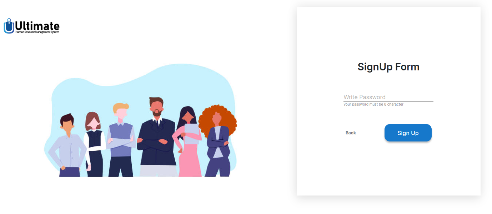
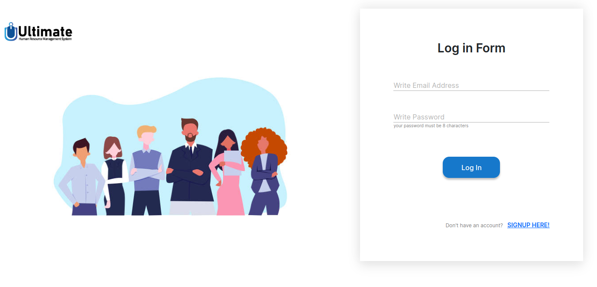
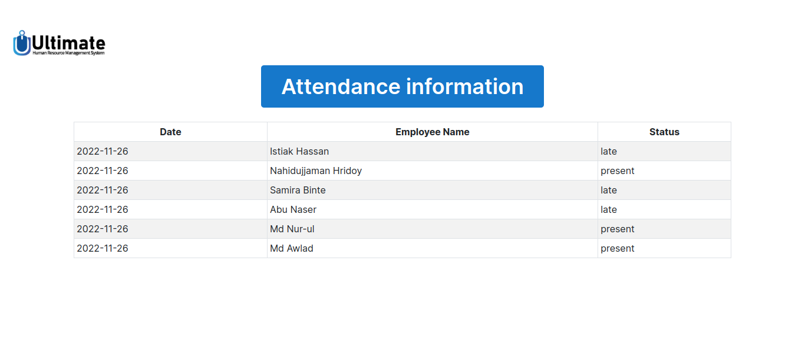

# Front End Developer Task
## Screenshots 📸

### Sign Up Form Step 1
  <a href="https://front-end-intern-tasks.vercel.app/">
  <a>

### Sign Up Form Step 2
  <a href="https://front-end-intern-tasks.vercel.app/"> 
   <a>

### Sign Up Form Step 3
  <a href="https://front-end-intern-tasks.vercel.app/"> 
   <a>

### Log In Form Page
  <a href="https://front-end-intern-tasks.vercel.app/"> 
   <a>

### Attendance Page
  <a href="https://front-end-intern-tasks.vercel.app/"> 
   <a>

## Setup ✴️

- [x] Clone the repository using `https://github.com/Douglas254/Front-end-Intern-Tasks.git` or download and extract the zip file.
- [x] Open up the cloned folder in your preferred text editor. Open up a terminal within your workspace and navigate into the /Front-end-Intern-Tasks folder
- [x] Within that folder, run `npm install` which will install all dependencies for you then run `npm run dev` to run the development server on `http://localhost:5173/` then click on that local port path to open Vite + React application on browser. :boom:

## Endpoints API 🛠️

✅ [SignUp](https://test.nexisltd.com/signup) 

✅ [LogIn](https://test.nexisltd.com/login)

✅ [Test](https://test.nexisltd.com/test )

## Deployment ~ Vercel 🌍

View hosted site [here](https://front-end-intern-tasks.vercel.app/)

## Authors 🖊️

This project was contributed to by:

- [Douglas Obara](https://github.com/douglas254/)

## License 📄

The project is licensed under MIT